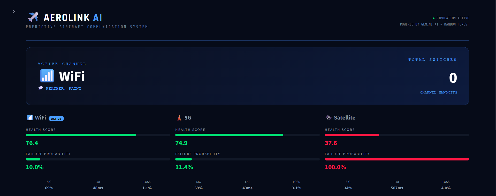
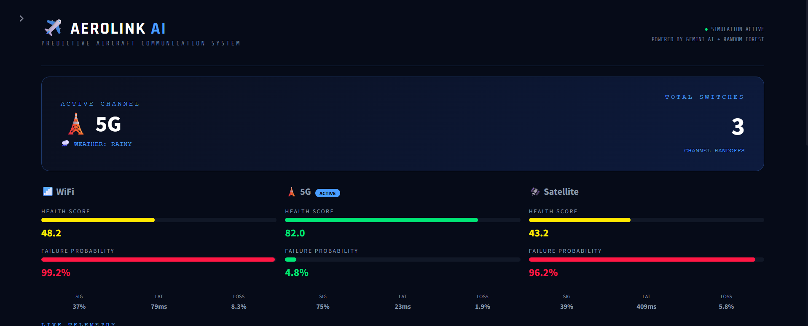
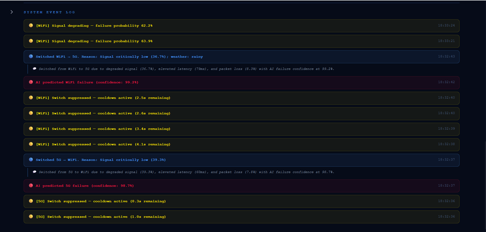
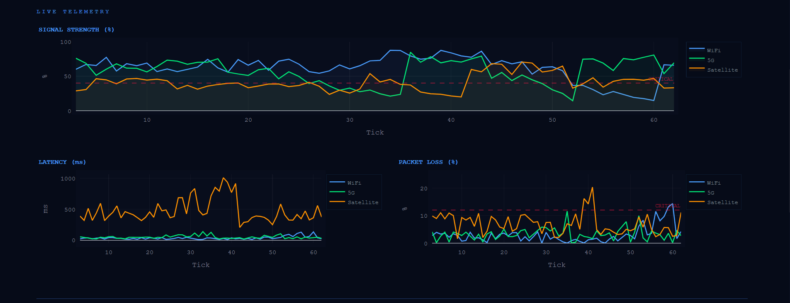
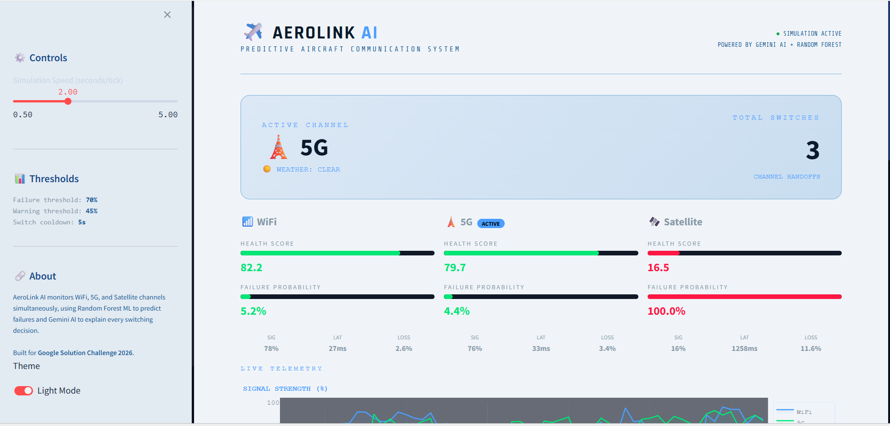

# AeroLink AI

AeroLink AI is a predictive communication system built for aircraft. The core idea is simple, instead of waiting for a channel to fail and then switching, the system watches all three communication channels (WiFi, 5G, and Satellite) at the same time and uses a machine learning model to predict which one is about to drop. When the confidence crosses a threshold, it switches automatically and logs why it happened in plain English using Google Gemini.

Built for the Google Solution Challenge 2026.

---

## Description

Traditional aircraft communication systems are reactive. They switch channels only after a connection is already lost. AeroLink AI is predictive — it monitors signal strength, latency, and packet loss across all channels every two seconds, detects early signs of degradation, and acts before the failure occurs.

The system also factors in weather conditions. Rain weakens satellite signals. Storms degrade everything. These environmental effects are simulated realistically so the AI learns to recognize them as contributing factors.

Every switching decision is explained. When the system switches from one channel to another, Google Gemini generates a one-sentence aviation-style log entry describing what happened and why. This makes the system transparent and auditable.

---

## Features

- Monitors WiFi, 5G, and Satellite channels simultaneously in real time
- Predicts channel failure probability using a trained Random Forest model
- Switches to the healthiest available channel before failure occurs
- Explains every switch in plain English using Google Gemini 1.5 Flash
- Simulates weather effects rain, clouds, storms per channel type
- Flap prevention via a 5-second cooldown between switches
- Live dashboard with signal charts, health scores, and a color-coded event log
- Light and dark mode support

---

## Tech Stack

- Python 3.10
- Streamlit : dashboard and UI
- scikit-learn : Random Forest model training and prediction
- Plotly : live telemetry charts
- Google Gemini API : natural language switch explanations
- NumPy and Pandas : data simulation and feature engineering
- joblib : model serialization

---

## How to Run

Clone the repository and install dependencies:

```bash
git clone https://github.com/msharshinee289/aerolink-ai.git
cd aerolink-ai
pip install -r requirements.txt
```

Add your Gemini API key to the `.env` file:

```
GEMINI_API_KEY=your_key_here
SIMULATION_INTERVAL=2
FAILURE_THRESHOLD=0.70
SWITCH_COOLDOWN=5
```

Train the model (run this once before starting the app):

```bash
python -m model.train_model
```

Start the dashboard:

```bash
python main.py
```

Then open `http://localhost:8501` in your browser.

---

## Basic Usage

Once the dashboard is running, the simulation starts automatically. You will see three channel cards at the top showing the health score and failure probability for WiFi, 5G, and Satellite in real time.

The active channel is highlighted with a blue border and an ACTIVE badge. As signals degrade, the health score drops and the failure probability bar turns yellow then red. When the AI predicts imminent failure with more than 70% confidence, the system switches to the next healthiest channel.

Every event is logged in the System Event Log panel at the bottom. Switch events include the Gemini-generated explanation directly below them.

You can adjust the simulation speed using the slider in the sidebar. The weather changes randomly during the simulation — stormy conditions will visibly tank the satellite signal and latency.

---

## Screenshots

**System monitoring — normal state**


**Channel switch detected**


**System event log with Gemini explanations**


**Live telemetry charts**


**Light mode**

